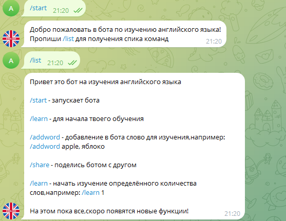

# Привет! 👋 Меня зовут Алексей

Python разработчик

- 🌱 Изучаю: Pygame, Aiogram 3, Python 3.12

🔗CodeWars: https://www.codewars.com/users/AlexeyTsekun2011

🔗LeetCode: https://leetcode.com/u/alexeytsekun2011/

 

## 🛠️ Мои технологии:

  

## 📈 GitHub Статистика

## 🖼️ Проекты

# 🎮🕹️👾 Игры

📌 Platformer
   

   
🔗 Link: [Platformer](https://github.com/AlexeyTsekun2011/Platformer)

📌 Flappy bird 
   

   
🔗 Link: [Flappy Bird](https://github.com/AlexeyTsekun2011/Flappy-Bird)

# Telegram боты
📌Get Telegram ID

🔗 Link: [Get Telegram ID](https://github.com/AlexeyTsekun2011/Get_telegram_id)

📌English Study Bot

🔗 Link: [Flappy Bird](https://github.com/AlexeyTsekun2011/EnglishEducationBot)

## 📄 Лицензия

Этот профиль и все размещённые здесь проекты могут использоваться в не коммерческих целях и в целях обучения
